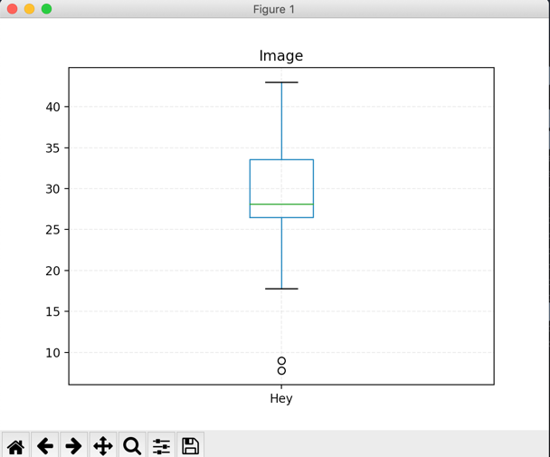
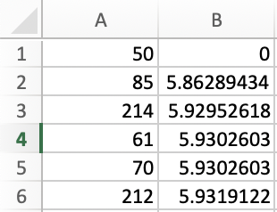
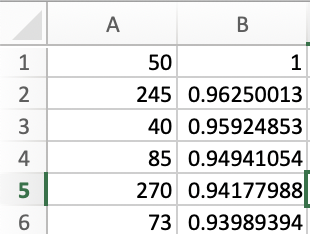
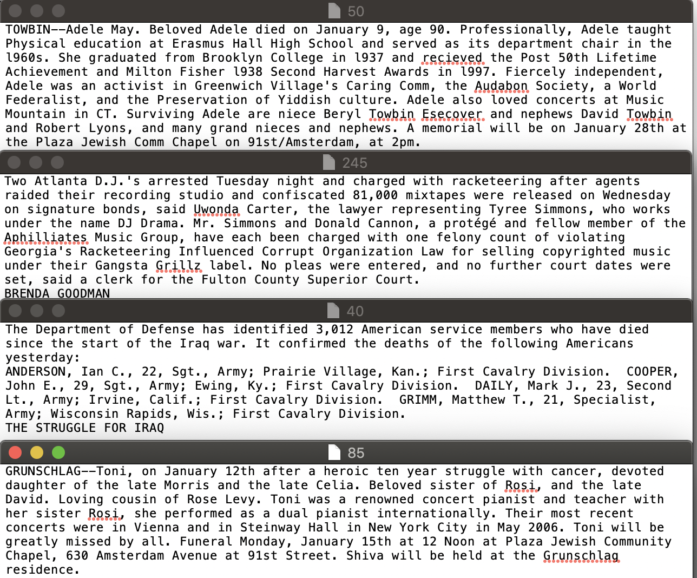
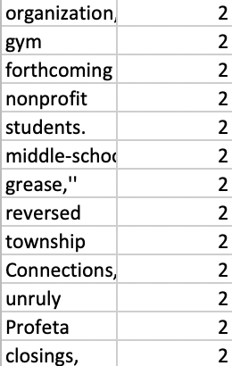

# 数据挖掘 HW1

计62  2016080036  金镇书

程序运行方式：

同一目录下需要有“nyt_corp0”文件夹，然后运行python3 tf_idf.py , 第二题是 python3 similarity_matrix.py


## Q1

1. Ordinal ： 教师的职称有高低之分，有顺序

2. Nominal：手机号码之间没有关联性

3. Ratio：体重有增长率，除法有意义

4. Interval：相除没有意义，但是有顺序

5. Nominal：相互没有关联性

6. Ratio：年龄是一个时间长度，存在0

## Q2

1. 均值 = 28.01875，中位数 =  28.1， 众数 = 26.5

2. 五数概括法：最小值 = 7.8 第一四分位数 = 26.5中位数 = 28.1第三四分位数 = 33.75 最大值 = 43.0

箱线图：




## Q3

### 1. 文档的表示

#### 实现思路/遇到的问题

​	文章的表示是通过tf-idf向量的计算，并用欧式距离、余弦相似度来对两篇文章的相似度进行判断。

​	在刚开始编程时，对于tf的计算，只统计了单个文档里的词，也就是随机抽取两篇文章的并集比较小，结果发现计算欧式距离，余弦相似度时，两个向量的值不好相乘，词语的顺序也不一样，于是改成了构造一个包含所有语料的词典(从处理好的语料库中提出)，这样就变得非常方便计算。

​	计算tf * idf时，发现速度过慢，几乎每个文档一分钟，经过调试发现是由于两篇文章都是用的大的词典(包含所有词)，所以计数为0的也有加入计算。通过一次if门将分析一篇文档的时间降低到了大约0.3秒。

#### 算法分析

```
预处理：合成语料库(所有文档)，获取nyt_corp0下的所有文件，然后形成可以计数的词典(dict)
for i in 文件个数:
	计算单个文件里所有词的tf值
	for j in 文件里的词:
		计算单个文件的idf值
		tf *= idf，结果放进tf_idfList里
for i in 文件个数:
 	与第x个文件进行余弦相似度的计算以及欧式距离的计算，以csv格式输出并进行排序
	(尝试了通过python的字典进行排序，但结果并没有排序成功，股4输出为csv形式进行了排序)
```

#### 结果分析

​	输出文件为cosList.csv和disList.csv

​	计算了与第50个文件相似的文件

​	首先分析欧式距离相近的文章：

​	

​	因为50是它本身，不进行分析。

​	50与前两篇文章的对比：

​	

​	可发现这三篇文章都是在叙述一个人的事情，并且日期(数字)较多，结构上比较相似，剩下三篇虽然结构与第50篇稍微有些变化，但内容大致上也是内容相似。


​	再分析余弦相似度：

​	

​	前三篇文章的比较：



​	与欧式距离分析的还是有些差别，这几篇篇幅比较相近，都出现了数字，没有截屏的270和73也是与这几篇差不多相似。


### 2. 词语的表示

#### 实现思路/遇到的问题

​	词语的表示，第一步是先构造词典：key为单词，value为它所在的文档集合。求共现矩阵的时候，通过求两个单词的文件集合的并集，得到的集合的长度即为共现次数。

​	而一开始我以为共现次数是指每两个单词在每个文章中一起出现的次数，即有两个单词分别在单个文章中出现了3，2次，共现次数为2.结果导致我的算法时间复杂度整整有n的四次方，发现根本无法运行之后通过与同班同学进行讨论才知道了它真正的意思。

#### 算法分析

```
预处理：读取所以文档合成语料库，形成词典(key : word, value : set(documents)) (若单词在该文档中则 set.add(该文档))
for i in range(语料库长度)：
	for j in range(语料库长度)：
		if i >= j： 			# 只计算下三角，提升计算速度，循环结束后因为是对称矩阵，上三角复制即可
			temp = [两个词语文档集合的并集]
			matrix[i][j] = len(temp)
for i in 词语个数:
 	与第x个词语进行余弦相似度的计算以及欧式距离的计算，以csv格式输出并进行排序
```


#### 结果分析

输出文件: cosList2.csv和disList2.csv

​	与文章的表示不同的是，可能是数值的问题，整数居多，所以计算出来的结果相近/相似的比较多，这里只列出一些进行分析。

​	与词语disruptive进行了分析，意义为破坏的，分裂的，扰乱的

​	发现了一个问题就是欧式距离/余弦相似度分析的词语都几乎差不多，故放在一起分析，其中比较相似的为：

 1. disrupting (该次的动名词形式)

 2. unruly (任性的，不守规矩的)

 3. offending (不愉快的，厌恶的)

 4. reversed (推翻)

    而其余的词我并没有找出有相关性，可能是词语向量计算的问题所导致的，但由于马上就是ddl了，并没有来得及更加深入的分析，望助教和老师谅解。

    
