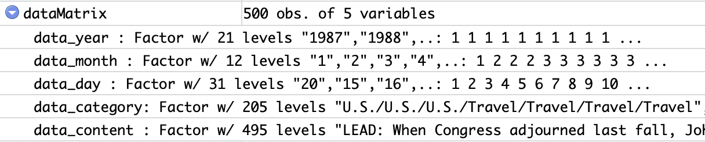
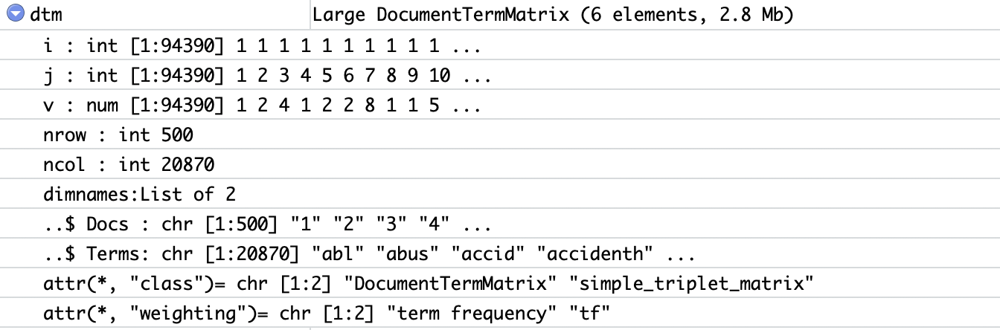
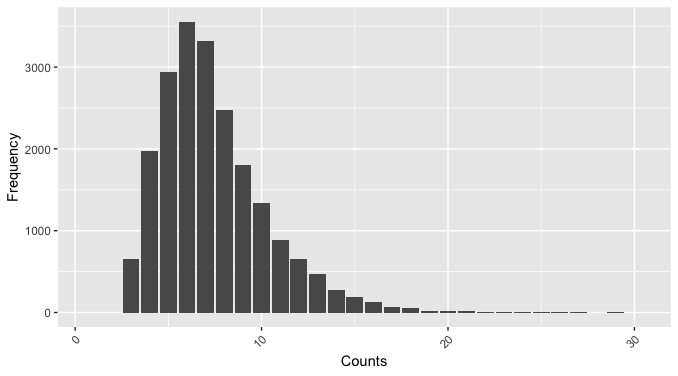
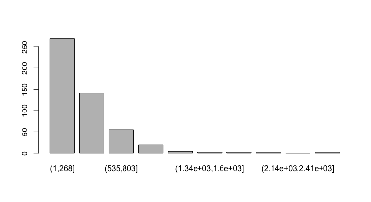
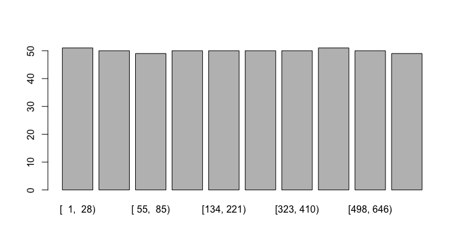
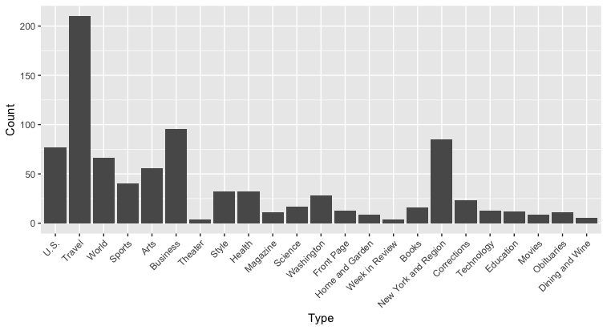
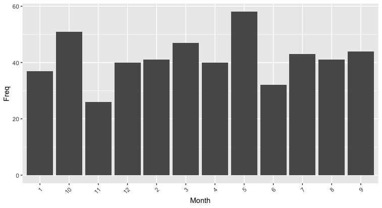
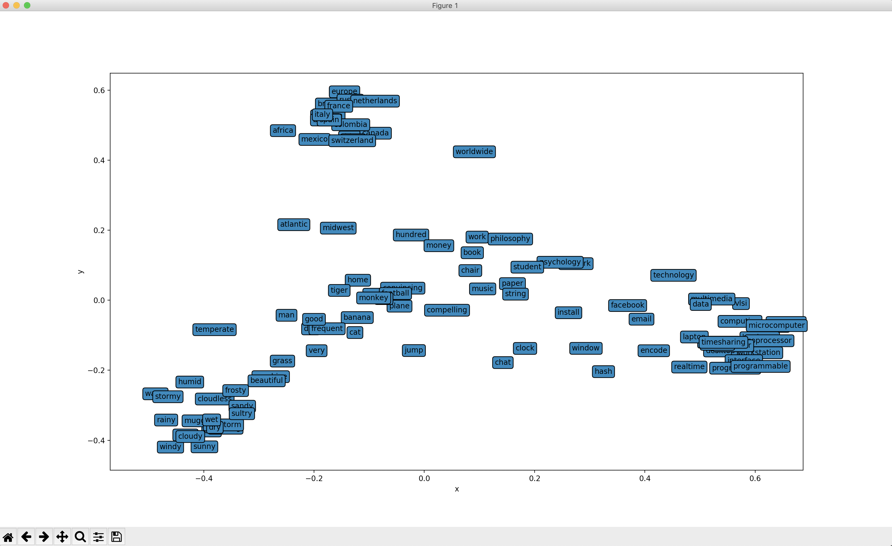
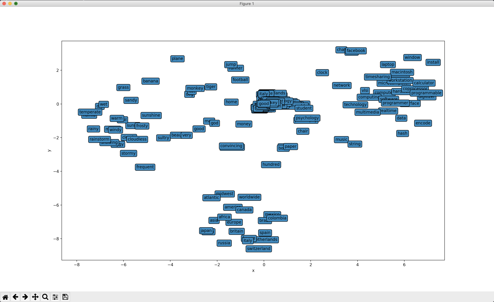

# HW2 实验报告

计62  金镇书  2016080036

## 1. 数据预处理和可视化

### 1.1 建立数据帧

​	总共500篇文章，需要提取出 1. 类别 2. 年，月，日（分开）3. 正文。

​	通过xml库将每个文件解析为xml节点，通过list的访问方式,，对xml格式的各个元素进行访问。	

​	每次遍历通过合并数据帧来维护一个总的数据帧。

​	生成的数据帧如下：

​			

 ### 1.2 1.3 进行预处理，表示成BagOfWords向量

​	通过demo.R给的预处理代码部分进行预处理：

​	

### 1.4 取100个高频词，画出云图

​	demo.R里也有给这部分的代码，只需要调用colSums()来进行求和即可得到需要的向量。

### 1.5 单词长度的分布情况

​	通过前面得到的dtm来提取所有语料中的词语进行长度的计算并进行统计，经过输出发现不会有词语超过30的长度，于是最大长度设为了30.

### 1.6 分箱

#### 等宽分箱

​	此部分可以用cut函数进行分箱：

​	

#### 等深分箱

​	用了Hmisc库的cut2函数。

### 1.7 每个类别的新闻数量分布

​	之前我存类别时，将多个类别用'/'进行分隔，合并为了字符串存到了data_category里，在这里通过strsplit函数进行分割，并且每个新闻里出现的重复的词进行了去重。

​	由于要给每个类进行计数，用了数据帧进行了统计，比较方便。

### 1.8 根据月份的新闻统计

​	用之前存好的data_month数据，用summary函数可以自动统计出数值：

## 2. 高维向量可视化

### PCA降维

​	直接用了python里的sklearn.decomposition的PCA，n_components设为2，说明要降到二维。txt中的数据，先提取出了单词的列表，再将每个单词的100个数据作为一个list存了起来，通过fit方法进行了降维，画出来的图如下：

### t-SNE降维

​	也用了sklearn.manifold的TSNE，代码与PCA一样，只是把PCA换成了TSNE：

​	可发现PCA图的左下角，顶部和右方汇聚的比较多，分别是天气，地名(国家，大洲)，计算机词汇的大类。

t-SNE的图中，左边，下边，右上比较分布明显，分别是，天气，地名，计算机词汇。还可以发现t-SNE的中间部分聚集的比较密，可见在没有设置额外的参数的情况下，PCA降维比较好。